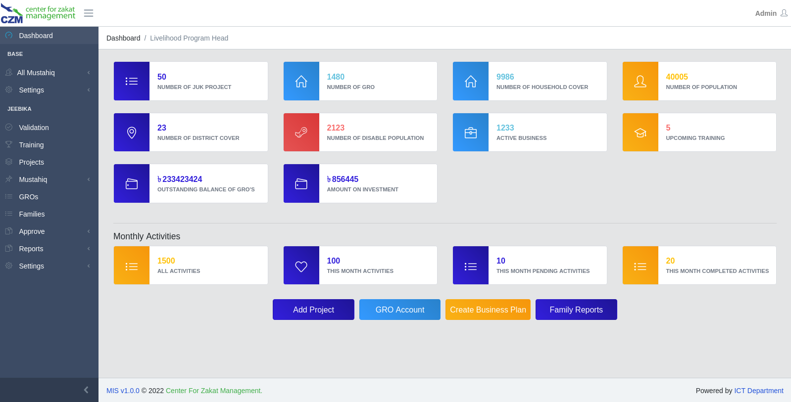
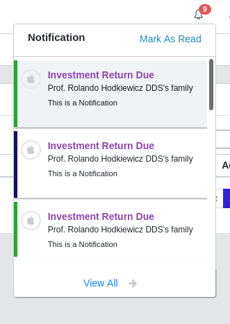

<p align="center">
<a href="https://czm-bd.org/">

</a>
</p>
<p align="center">

 
 
  

</p>

## About MIS

   

This application is based of Laravel 9 & Vue js 2. There's several modules.

- [HRM](https://hrm.czm-bd.org/) which totally separate module & developed
- [Base Modules for All](https://czm-bd.org/).
- [Jeebika Module](https://czm-bd.org/) For Jeebika Department of CZM.
- Multiple back-ends for [session](https://laravel.com/docs/session) and [cache](https://laravel.com/docs/cache)
  storage.
- Expressive, intuitive [database ORM](https://laravel.com/docs/eloquent).
- Database agnostic [schema migrations](https://laravel.com/docs/migrations).
- [Robust background job processing](https://laravel.com/docs/queues).
- [Real-time event broadcasting](https://laravel.com/docs/broadcasting).

## Note

- Family Accounts Settlement will debit

## Theme

- https://coreui.io/docs/2.1/getting-started/introduction/

## Package

- <a href="https://vee-validate.logaretm.com/v2/guide/">Vee Validate</a>
- Laravel Query Detector
- Laravel Debugger

### Frontend Sample Code

## Notification Dropdown

   

```html

<div class="dropdown-menu dropdown-menu-right custom-dropdown">
    <div class="d-flex justify-content-between dropdown-item dropdown-title">
        <h5>Notification</h5>
        <a href=""><i class="fa fa-envelope-open-o mx-1" aria-hidden="true"></i>Mark As Read</a>
    </div>
    <div class="notification-area">
        <div class="dropdown-item">
            <a class="" href="">
                <div class="d-flex justify-content-between">
                    <div class="dropdown-logo">
                        <i class="fa fa-apple"></i>
                    </div>
                    <div>
                        <p class="notification-title">
                            Investment Return Due
                        </p>
                        <p class="notification-sub-title">
                            Prof. Rolando Hodkiewicz DDS's family
                        </p>
                        <p class="notification-message">
                            <small> This is a Notification</small>
                        </p>
                    </div>
                </div>
            </a>
        </div>
    </div>
    <a href="" class="dropdown-item dropdown-footer">
        View All <i class="fa fa-arrow-right mx-2" aria-hidden="true"></i>
    </a>
</div>
```

### Join

<code>
        $jt = JTraining::getTableName();
        $v = Vocational::getTableName();
        $s = Skill::getTableName();
        $p = JProject::getTableName();

        $data = DB::table($jt . ' as jt')
            ->join($p . ' as p', 'p.id', '=', 'j_project_id')
            ->join($v . ' as v', 'v.id', '=', 'vocational_id')
            ->select('jt.*', 'jt.created_at as created_at', 'p.*', 'p.name as project_name', 'v.name as vocational_name')
            ->where(function ($sql) use ($query) {
                $sql->where("p.name", "LIKE", "%" . $query . "%");
            })
            ->orWhere(function ($sql) use ($query) {
                $sql->where("v.name", "LIKE", "%" . $query . "%");
            })
            ->orderBy($sort, $type)->paginate($item);

</code>

## Contributing

<a href="https://github.com/SKToke">@solaiman khan</a>
<a href="https://github.com/geekfahim">@geekfahim</a>
are core developer who developed this application

the [Laravel documentation](https://laravel.com/docs/contributions).

## License

The Laravel framework is open-sourced software licensed under the [MIT license](https://opensource.org/licenses/MIT).
"# cims"
